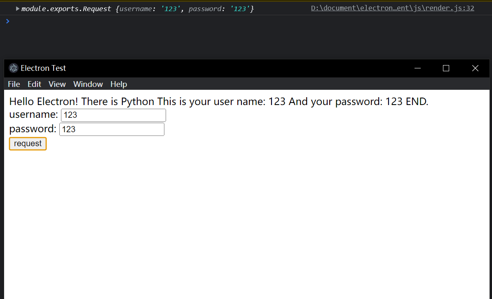

# electron-rpc
An RPC client on electron, and python as backend platform.

***

## How to run

1. Install [thrift](https://thrift.apache.org/download) and add thrift in to PATH. Make sure run ```thrift --version``` has its version output.  
1. Run [gene.bat](./thrift_files/gene.bat) or write your own bash script.
1. In [Client](./client/), run ```npm install thrift electron```
1. (Optional) Create a Python virtual environment
1. In virtual environment or normal python environment, run ```pip install thrift```
1. Modify Python path in [main.js](./client/main.js) to where your python is.
1. In [Client](./client/), run ```npm start``` and try it!

## screen shot



## caution:

* If you try to run Python script directy, you may unable to send Interrupt Signal to it. Please send KILL SIGNAL to Python process.
* RPC will use 127.0.0.1:8000 as local data transfer, if this port has been used, please modify it in [main.js](./client/js/render.js) and [main.py](./server/main.py)

***
Author: [LuoXishuang](https://www.github.com/LuoXishuang0712)
